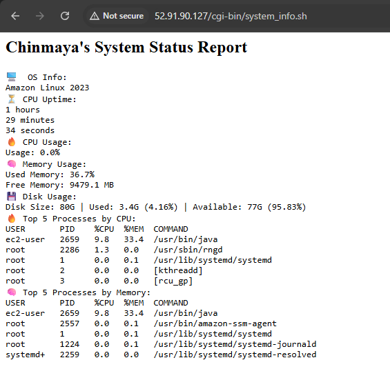
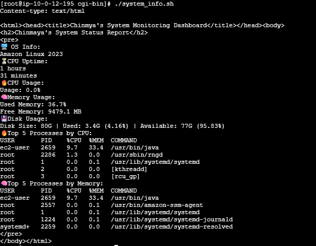

# System-Monitoring-Dashboard
A real-time web-based monitoring tool using Bash scripting and Apache HTTPD. It tracks OS info, CPU uptime, memory usage, disk usage, and active processes dynamically.

🚀 Features ✔ Live system insights (CPU, Memory, Disk) ✔ Top processes by CPU & Memory ✔ Web-based dashboard (HTML, CSS) ✔ Auto-refresh with Apache CGI

🔧 Use Cases: ✅ Server monitoring ✅ Resource management ✅ Lightweight tracking

# 🖥️ System Monitoring Dashboard

A real-time **system monitoring dashboard** built using **Bash scripting** and served via **Apache HTTPD**. This project provides live insights into **OS information, CPU uptime, memory usage, disk usage, and top processes**.

## 🚀 Features

- 📌 **OS Information** – Displays system name and version.
- ⏳ **CPU Uptime** – Shows total uptime in days, hours, minutes, and seconds.
- 🔥 **CPU Usage** – Dynamically updates CPU utilization percentage.
- 🧠 **Memory Usage** – Monitors used/free memory in MB.
- 💾 **Disk Usage** – Tracks total size, used space, and available space with percentage.
- 🔥 **Top Processes** – Lists the top 5 processes by CPU and memory usage.
- 🌐 **Web-Based Dashboard** – Accessible via a browser with a simple HTML and CSS interface.

## 🏗️ Setup & Installation

### **1. Install Apache HTTPD**
Install and start Apache:
```bash
sudo apt update && sudo apt install apache2 -y  # Ubuntu/Debian
sudo yum install httpd -y  # CentOS/RHEL
sudo systemctl start httpd
sudo systemctl enable httpd
```

2. Move Bash Script to CGI Directory
```bash
git pull https://github.com/chikuchinmaya/System-Monitoring-Dashboard.git
sudo mv system_info.sh /var/www/cgi-bin/
sudo chmod +x /var/www/cgi-bin/system_info.sh
```

3. Enable CGI in Apache
Modify your Apache config file:

```bash
sudo nano /etc/httpd/conf/httpd.conf  # CentOS/RHEL
sudo nano /etc/apache2/apache2.conf  # Ubuntu/Debian
```

Add:

```bash
ScriptAlias /cgi-bin/ "/var/www/cgi-bin/"
<Directory "/var/www/cgi-bin">
    AllowOverride None
    Options +ExecCGI
    Require all granted
</Directory>
Restart Apache:
```

```bash
sudo systemctl restart httpd
```
Access the Dashboard
Open your browser and visit:

http://your_IP/cgi-bin/system_info.sh



Also you you can run your CMD in Same system.

```bash
./system_info.sh
```


